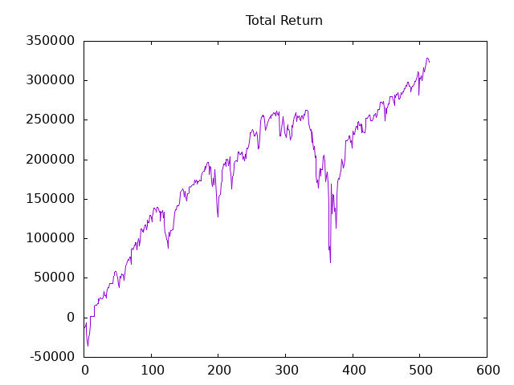

## About

This project is to update live positions and trade results of automated paper trading of futures contracts of [Micro E-mini S&P 500 Index](https://www.cmegroup.com/markets/equities/sp/micro-e-mini-sandp-500.html#venue=globex).

The strategies used are constructed using XJ-Strategist, a machine learning and AI system capable of constructing and validating sustainable trading strategies, as introduced and showcased [here](https://github.com/XilinJia/XJ-Strategist).

Position and returns data here are automatically updated daily just after the market close of CME directly from my trade server.

## Current positions

2025-09-02 20:57:00(UTC), MES U25.CME_Eq, Price = 644350, Position = 31

## Past trades and returns

Start of plot is 2023-10-19

*** Failed to login to broker platform on Mar 17 2025, positions and results are repaired based on back-filled data.
*** Due to instability issues at broker platform, positions and results during Feb 14-25, 2025 might be repaired based on back-filled data.  ****
*** Due to issues with broker platform, positions and results during Aug 4-13, 2024 are based on back-filled data.  ****

The following file contains dates (of trade opening), daily closing prices, positions at daily market close, daily returns, and cumulated returns.

The daily prices are of a continuous contract that is formed by rolling and stitching previous contracts with the current contract.  The algorithm of forming the continuous contract can be found [here](https://github.com/XilinJia/Stitcher).

[CSV file](trades.csv)

## Trade positioning

A contract of Micro E-mini S&P 500 Index futures is valued at $5 times S&P 500 Index.  At the trading platform of the brokerage, the quoted index of S&P 500 Index comes in as 100 times the actual S&P 500 Index, thus a contract is valued at $0.05 times the quoted index.

The maintenance margin requirement is 5%.

I use a maximum of $50,000 as margin to enter into trades.  So the trade value (based on 5% margin) is equivalent to a maximum of $1 million.

As an example. if the quoted index is 400,000, then at maximum my position would be (50,000 / 0.05) / (400,000 * 0.05) = 50

"maximum" here means trades are not always using the full capital, but depend on an algorithm of position sizing at the time.

## Historical performance of the strategy

Performance in training period (2000-01-03 through 2009-02-23):

Performance on entire dataset, in-sample and out-sample, (2000-01-03 through 2024-02-29. Note the training section at the beginning of the data set):

